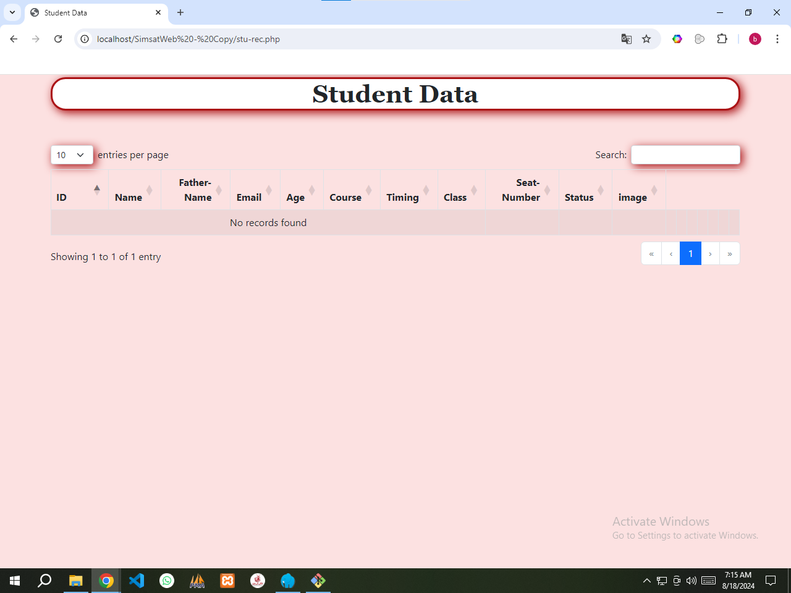
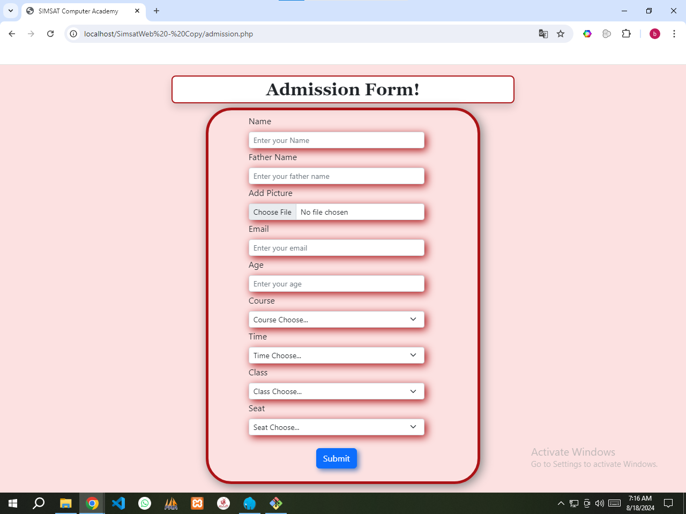

# Student Management System

**Description:**
This complex student administration system was carefully crafted using PHP and a MySQL database to effectively oversee various academic operations across changing schedules and classrooms within a learning environment. The system supports varied attendance marking, reserved seating, status control, module tracking, historical reporting, profile editing, and intuitive access in a data-driven interface.

## Features

- **Automatic Attendance Detection:** Considers dynamic class times while determining absentees based on unchecked attendance.
- **Reserved Seating:** Places in specific lessons and slots can only be booked once. If already taken, they become unavailable for that interval.
- **Status Management:**
  - **Continue:** Seats held.
  - **Complete:** No reservation.
  - **Left:** No reservation.
  - **Freeze:** Temporarily omits students with seats freed for leave or absence.
- **Module Tracking:** Tracks completion progression for each student's curriculum.
- **Attendance History:** Allows individual or entire class viewing and printing within chosen date spans.
- **Student Profile Management:** Learners can manage uploaded account images internally.
- **Efficient Record Access:** All records across the system remain easily reachable through a data table for efficient administration.

## Setup Instructions

1. Import the provided MySQL database file from the `database` folder.
2. Confirm that the connection matches your storage configuration.
3. The system is now operational, handling student attendance, seat reservations, class status monitoring, module progress tracking, attendance records, and student profiles.

## Requirements

- PHP 7.x or greater
- MySQL 5.7 or above
- Apache/Nginx Server

## License

This project is freely available under the MIT License.

## Screenshots

