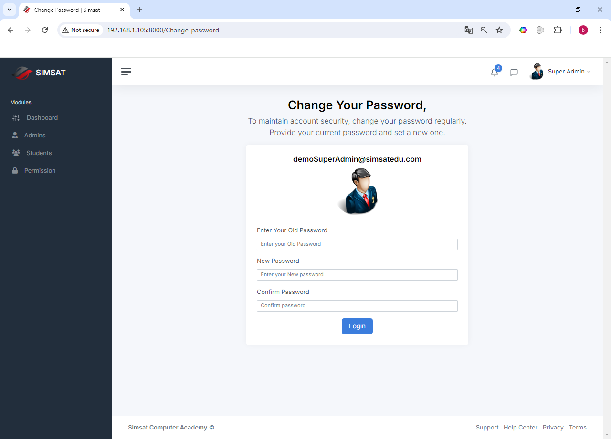

# Student Management System

This Student Management System is developed for a center to manage various operations, including student admissions, seat reservations, and classroom management. Originally created in core PHP, it has been converted to Laravel with a MySQL database. The system is designed to handle multiple time slots, with each hour having 4 classrooms and each classroom accommodating 6 students. A seat in a specific time slot can only be reserved by one student. Once reserved, it becomes unavailable for others, ensuring accurate and easy management.

This system centralizes all management tasks, making it simpler for the administration to operate efficiently. The Super Admin has full authorization to manage all aspects, including adding or deactivating admins, handling student admissions, and viewing or resetting email and password details for both students and admins. Students and admins can request changes to their profiles, profile pictures, or passwords, which require Super Admin approval.

**Future Plans:**
The system will maintain student status as:
1. **Continue:** Reserved seat = 1
2. **Complete:** Reserved seat = 0
3. **Left:** Reserved seat = 0
4. **Freeze:** Reserved seat = 0

The Super Admin can assign classes to teachers based on their schedules. Teachers can manage attendance and update modules based on the permissions granted by the Super Admin. Student status is updated automatically as modules are completed, ensuring that the course is marked complete only when all modules are finished.

The system includes a module ticker, allowing both admins and Super Admins to track module progress. Teachers can mark attendance for their classes, and admins can view attendance data for all their assigned classes.

**Documentation:**
To run this software, follow these steps:
1. Run the migrations.
2. Execute the route `/important/data` to store critical data, such as generating the default Super Admin credentials.

**Default Super Admin Credentials:**
- **Email:** demoSuperAdmin@simsatedu.com
- **Password:** demo@super

## Screenshots

